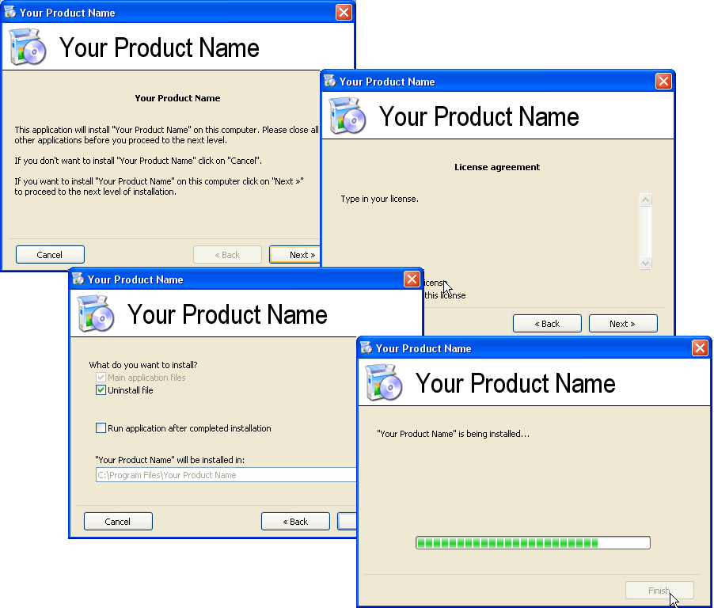



## T\-Install

### Description

This code will help you make your own installation file.

All you have to do is:

1. Choose a directory in wich your application is goinf to be installed.

2. Vote for my code :)
 
### More Info
 

             |
---                |---
**Submitted On**   |2004-07-31 13:28:02
**By**             |[Nikola Milovic](https://github.com/Planet-Source-Code/PSCIndex/blob/master/ByAuthor/nikola-milovic.md)
**Level**          |Intermediate
**User Rating**    |4.3 (17 globes from 4 users)
**Compatibility**  |VB 5\.0, VB 6\.0
**Category**       |[Files/ File Controls/ Input/ Output](https://github.com/Planet-Source-Code/PSCIndex/blob/master/ByCategory/files-file-controls-input-output__1-3.md)
**World**          |[Visual Basic](https://github.com/Planet-Source-Code/PSCIndex/blob/master/ByWorld/visual-basic.md)
**Archive File**   |[T\-Install1776017312004\.zip](https://github.com/Planet-Source-Code/nikola-milovic-t-install__1-55260/archive/master.zip)

